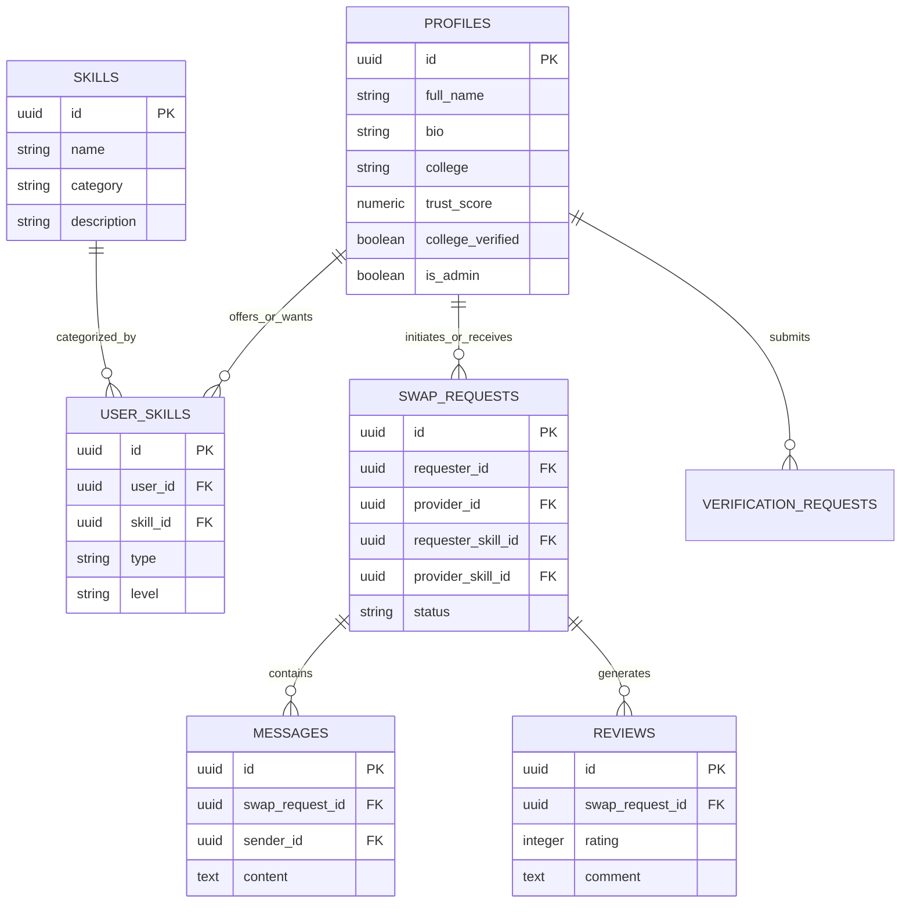

#  SkillSwap - Peer-to-Peer Skill Exchange Platform


**SkillSwap** is a modern, peer-to-peer web application designed for students and self-learners to teach skills they master and learn new skills from others — completely free of financial barriers. Swap coding knowledge for language lessons, design feedback for music tutorials, or academic tutoring for project collaboration.

---

##  Features

###  Discovery & Matching
- **Interactive Explore Page**: Search and filter members by skill name, category (Tech, Design, Languages, Music, Academics, etc.), proficiency level (Beginner, Intermediate, Expert), and verification status.
- **Smart Skill Matchmaking**: Discover users whose wanted skills align with what you offer, enabling seamless two-way skill exchange.

###  Swap Request Lifecycle
- **Propose Swaps**: Send tailored exchange requests specifying "I teach X in return for learning Y" along with custom messages and preferred schedules.
- **Request Management**: Track inbound and outbound swap proposals with statuses (`Pending`, `Accepted`, `Rejected`, `Ongoing`, `Completed`).
- **Session Scheduling**: Coordinate convenient meetups or video sessions directly through the app.

###  Real-Time In-App Messaging
- **Chat System**: Integrated messaging platform connected to each active swap request.
- **Attachments & Media**: Share documents, links, and learning resources directly inside the chat.

###  Trust & Safety
- **Verification System**: Users can submit College IDs or skill credentials for administrative approval to receive verified badges.
- **Trust Score & Ratings**: Post-swap rating (1–5 stars) and feedback mechanism to calculate trust scores and ensure community safety.
- **Safety Controls**: Block unsupportive users and report policy violations.

###  Admin Control Panel
- **Verification Management**: Review and approve/reject submitted college documents and skill certificates.
- **Platform Analytics**: Monitor active swaps, registered profiles, and user trust metrics.

---

##  Tech Stack

- **Frontend**: [React 18](https://react.dev/), [TypeScript](https://www.typescriptlang.org/), [Vite](https://vitejs.dev/)
- **Styling**: [Tailwind CSS](https://tailwindcss.com/), PostCSS, [Lucide React](https://lucide.dev/) (Iconography)
- **Routing**: [React Router v6](https://reactrouter.com/)
- **Backend & Database**: [Supabase](https://supabase.com/) (PostgreSQL, Supabase Auth, Row Level Security)
- **State Management**: React Context API (`AuthContext`)

---

##  Database Architecture

SkillSwap uses PostgreSQL hosted on Supabase with Row Level Security (RLS) policies protecting every table:



---

##  Project Structure

```text
SkillSwap/
├── public/                    # Static assets
├── src/
│   ├── assets/                # Images and SVG graphics
│   ├── components/            # Reusable UI components
│   │   ├── NotificationBell.tsx     # Header notification badge
│   │   ├── ProtectedRoute.tsx       # Auth route guard
│   │   └── RequestNotification.tsx  # In-app request alerts
│   ├── contexts/              # Global state providers
│   │   └── AuthContext.tsx          # Supabase auth session wrapper
│   ├── hooks/                 # Custom React hooks
│   │   └── useBlockedUsers.ts       # Blocking & filtering hook
│   ├── lib/                   # Utility configurations
│   │   └── supabase.ts              # Supabase JS client setup
│   ├── pages/                 # Full application views
│   │   ├── AdminDashboard.tsx       # Verification review & stats
│   │   ├── Dashboard.tsx            # Main user hub & active swaps
│   │   ├── Explore.tsx              # Skill discovery & filtering
│   │   ├── ForgotPassword.tsx       # Password recovery page
│   │   ├── Landing.tsx              # Marketing & feature showcase
│   │   ├── Login.tsx                # User authentication page
│   │   ├── Messages.tsx             # Real-time swap chat
│   │   ├── Profile.tsx              # User public profile & reviews
│   │   ├── ProfileSetup.tsx         # Edit skills and bio
│   │   ├── Review.tsx               # Post-swap review submission
│   │   ├── SignUp.tsx               # User registration page
│   │   ├── SwapRequests.tsx         # Manage incoming/outgoing swaps
│   │   └── Verification.tsx         # Submit college ID & credentials
│   ├── App.tsx                # App routing configuration
│   ├── main.tsx               # DOM React mounting entry point
│   └── index.css              # Global styles & Tailwind imports
├── superbase/
│   └── migrations/            # SQL migration scripts & RLS policies
│       ├── 20260226062703_create_skillswap_schema.sql
│       └── 20260412093734_add_missing_indexes_and_optimize_rls.sql
├── package.json
├── tailwind.config.js
├── tsconfig.json
└── vite.config.ts
```

---

##  Getting Started

### Prerequisites

- [Node.js](https://nodejs.org/) (v18.0 or higher recommended)
- `npm` or `yarn` / `pnpm`
- A [Supabase](https://supabase.com/) project account

### 1. Clone the Repository

```bash
git clone https://github.com/jidnyasa216/SkillSwap.git
cd SkillSwap
```

### 2. Install Dependencies

```bash
npm install
```

### 3. Environment Setup

Create a `.env` file in the root directory:

```env
VITE_SUPABASE_URL=https://your-supabase-project.supabase.co
VITE_SUPABASE_ANON_KEY=your-supabase-anon-key
```

### 4. Database Setup

1. Open your Supabase Project Dashboard -> **SQL Editor**.
2. Run the migration SQL files found in `superbase/migrations/`:
   - First execute `20260226062703_create_skillswap_schema.sql`
   - Then execute `20260412093734_add_missing_indexes_and_optimize_rls.sql`

### 5. Run Locally

Start the local Vite development server:

```bash
npm run dev
```

The application will be available at `http://localhost:5173`.

---

##  Available Scripts

| Command | Description |
|---|---|
| `npm run dev` | Starts the Vite dev server with hot module replacement (HMR) |
| `npm run build` | Compiles TypeScript and builds production assets to `dist/` |
| `npm run preview` | Previews the production build locally |
| `npm run lint` | Runs ESLint to check for code quality and style issues |
| `npm run typecheck` | Validates TypeScript types across the app without emitting code |

---


